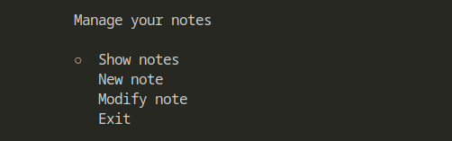
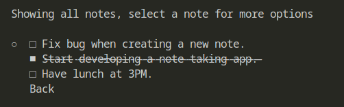

**noteapp** is a note taking app made in Python and SQLite3 to help you track your ideas efficiently and quickly.

### Examples
---
|         Main Menu          |         Notes Menu          |
| :--------------------: | :--------------------------: |
|  |  |
---

### Installation
---
- Install the Pick library through "pip install -r requirements.txt" or via a venv (then pip install pick)
- The rest of dependencies are already bundled within Python's standard library (Python 2.5 and newer)
- Execute the program and a new database will be created for you to use, that's all! :) 

---

### Usage
---
- **Show notes**: Shows all the notes a user might have stored, if a user hasn't created notes yet, they can go back to the menu and create a new note.
- **New note**: Allows a user to create a new note. Contents are stored locally.
- **Modify note**: Select an existing note and modify its content. *Will reset its state to undone*.

The options for existing notes are the following:

- **Mark as done/undone**: Mark an existing note as visually done or undone depending on its current state.
- **Modify this note**: Modifies the selected note.
- **Delete this note**: Deletes the note permanently, requires user confirmation.
---

